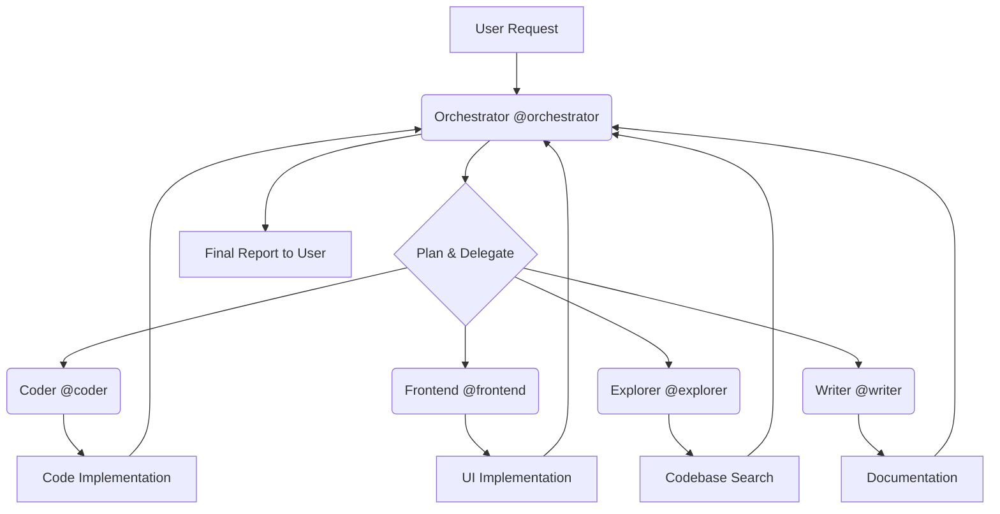

# 🧑‍🍳 Too Many Cooks 🧑‍🍳

## The Delegator Pattern for OpenCode: Too Many Cooks Spoil the Code? Not this time.

This project implements a powerful **delegator pattern** for OpenCode, turning the primary agent into a pure orchestrator that delegates all implementation work to a team of specialized, cost-optimized subagents.

---

## 🎯 What It Does

In a standard OpenCode setup, a single powerful agent (often an expensive, top-tier model) handles planning, coding, and documentation.

"Too Many Cooks" flips this script:

1.  **The Orchestrator** (a high-tier, highly capable model) focuses *only* on understanding the user's intent, planning the solution, and coordinating the workflow.
2.  **Specialized Subagents** (cheaper, task-specific models) execute the actual work—writing backend code, building UIs, searching the codebase, or writing documentation.

The Orchestrator **NEVER** writes code or edits files directly; it only delegates.

## ✨ Why Use It?

| Feature | Benefit |
| :--- | :--- |
| **Cost Optimization** | Use expensive models (like Opus) only for complex planning and reasoning, and cheaper models (like Flash or specialized coding models) for high-volume implementation. |
| **Specialization** | Agents are fine-tuned for their domain (e.g., `@frontend` knows React best, `@coder` knows algorithms). This leads to higher quality, more idiomatic code. |
| **Separation of Concerns** | Clear roles prevent context switching and improve reliability. The planner plans, the coder codes, and the writer documents. |
| **Scalability** | Easily add new specialist agents (e.g., `@tester`, `@security`) without overloading the primary agent's prompt. |

---

## ⚙️ Installation

### Prerequisites

You must have [OpenCode](https://opencode.ai) installed and configured with access to the specified models.

### Setup

1.  Clone this repository.
2.  Run the installation script to copy the agent configurations:

    ```bash
    ./install.sh
    ```

    *Note: This script will copy the contents of the `.opencode` directory into your OpenCode configuration folder.*

---

## 🧠 How It Works: The Delegation Workflow

The core of this architecture is the flow of control from the user to the specialized executor.



1.  **User Request**: The user provides a task to the primary agent.
2.  **Orchestrator (`@orchestrator`)**: Analyzes the task, reads context, and breaks it down into subtasks using its planning tools (`todoread`/`todowrite`).
3.  **Delegation**: The orchestrator uses the `task` tool to send a highly specific instruction to the appropriate subagent (e.g., `@coder` for a new API endpoint).
4.  **Execution**: The subagent executes the task using its specialized tools (`write`, `edit`, `bash`).
5.  **Reporting**: The subagent reports its completion back to the orchestrator.
6.  **Coordination**: The orchestrator reviews the result, coordinates the next step (e.g., delegating documentation to `@writer`), and finally reports the full completion to the user.

---

## 🧑‍💻 Available Specialists

The following specialized agents are configured to handle specific domains:

| Agent | Model | Primary Role | Key Capabilities | Cost Tier |
| :--- | :--- | :--- | :--- | :--- |
| **Orchestrator** | `claude-opus-4-5` | **Planner & Coordinator** | `read`, `glob`, `grep`, `task` (delegation) | **High** |
| **Coder** | `zai-coding-plan/glm-4.7` | **Backend & Logic** | `write`, `edit`, `bash` | **Medium** |
| **Frontend** | `gemini-3-pro-high` | **UI & Components** | `write`, `edit`, `bash` | **Medium** |
| **Explorer** | `opencode/grok-code` | **Codebase Search** | `read`, `glob`, `grep` (Read-Only) | **Low** |
| **Writer** | `gemini-flash-latest` | **Documentation** | `write`, `edit` | **Low** |

---

## 🚀 Usage Examples

While the orchestrator will automatically delegate, you can also manually invoke any subagent for a specific, one-off task.

### 1. Asking the Coder to Implement a Feature

```
@coder Implement the function \`getUserIdFromToken(token: string)\` in \`src/auth/utils.ts\`. It should decode the JWT and return the 'sub' claim.
```

### 2. Asking the Frontend to Update a Component

```
@frontend In \`src/components/Header.tsx\`, change the primary button color from blue to emerald-500 using Tailwind CSS.
```

### 3. Asking the Writer to Create Documentation

```
@writer Create a brief \`CONTRIBUTING.md\` file outlining our commit message conventions.
```

### 4. Asking the Explorer to Find Context

```
@explorer Find all files that import the \`User\` interface and list their paths.
```

---

## 🛠️ Customization

This setup is highly flexible. You can modify any agent's behavior by editing its configuration file in the `.opencode/agent/` directory.

### Adding a New Agent

1.  Create a new file, e.g., `.opencode/agent/tester.md`.
2.  Define its `mode: subagent`, `model`, and `tools` (e.g., give it `bash` for running tests).
3.  Update the `orchestrator.md` file to include the new agent in its prompt and delegation instructions.

### Modifying Capabilities

To change an agent's allowed actions, simply adjust the `tools` section in its configuration file. For example, to prevent the `@coder` from running shell commands:

```yaml
# .opencode/agent/coder.md
tools:
  # ...
  bash: false # Change from true to false
```

---

## 💰 Cost Optimization in Action

The core principle of "Too Many Cooks" is to match the model's cost to the complexity of the task:

| Task Complexity | Agent Used | Model Tier | Cost Strategy |
| :--- | :--- | :--- | :--- |
| **High** (Planning, Reasoning) | `@orchestrator` | High (Opus) | Use the best model where it matters most. |
| **Medium** (Code Implementation) | `@coder`, `@frontend` | Medium (Pro/Specialized) | Use fast, capable models for execution. |
| **Low** (Search, Documentation) | `@explorer`, `@writer` | Low (Flash/Grok) | Use the cheapest models for simple, high-volume tasks. |

This tiered approach ensures that you are not paying top-tier prices for simple tasks like writing a README or changing a CSS color.

---

## 📜 License

This project is licensed under the MIT License.
